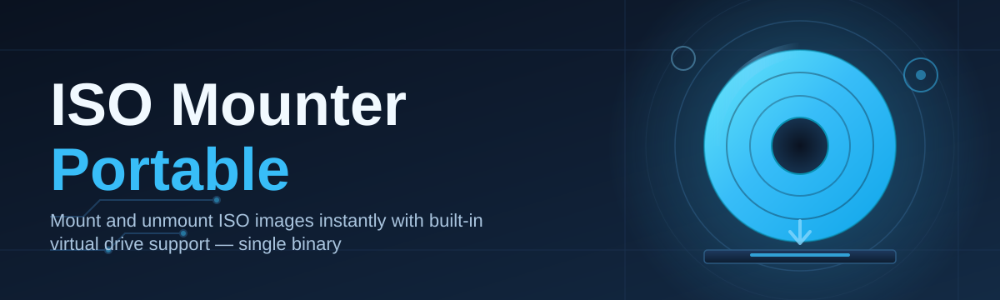

# iso-mount-utility 💿⚙️

  

*A single portable executable that turns any ISO into a virtual drive — no drivers, no installer, no fuss.*

  

---

## 🔎 Overview

Disk image files have quietly become the default way software gets distributed — Windows installers, Linux distributions, retro game backups, firmware bundles, you name it. Yet the tooling most people reach for to actually *open* those `.iso`, `.img`, or `.bin` files is either bloated with bundled adware, buried behind an installer wizard, or tied to a background service that outlives its usefulness. **iso-mount-utility** exists to strip that friction away: it's a portable ISO mounting tool that creates a virtual optical drive in seconds and gets out of your way.

The project is built for a specific kind of user — system administrators juggling recovery media, developers testing installer images, archivists cataloguing old software, and everyday users who just want to peek inside a disk image without installing anything permanent. If you've ever needed a lightweight ISO mounter for a locked-down machine, a shared workstation, or a USB toolkit, this tool was shaped with exactly that scenario in mind.

What separates this from the sprawling virtual drive suites of the past decade is restraint. There's no telemetry dashboard, no toolbar offer, no background daemon quietly consuming memory. It mounts an image, presents it as a drive letter, and waits patiently until you're done. That's the whole philosophy — a portable ISO mounter should feel like a screwdriver, not a subscription service.

> [!NOTE]
> The download button above points to the official project landing page. Builds are not distributed through any other channel — treat anything else claiming to be this tool with caution.

---

## 🧭 What It Actually Does

- **Instant virtual drive creation** — mount an ISO and get a real drive letter in your file explorer within seconds, no reboot required.

- **Zero-footprint execution** — the entire utility runs from a single `.exe`; nothing is written to `System32`, no registry sprawl, no leftover services after you close it.

- **Multi-format image support** — beyond standard `.iso`, the mounter reads common sibling formats like `.img`, `.nrg`, and `.bin/.cue` pairs without conversion steps.

- **Session persistence toggle** — choose whether mounted drives survive a reboot or unmount automatically when the app closes, depending on your workflow.

- **Batch mounting queue** — line up multiple images and mount them sequentially or all at once, useful when testing several installer builds back to back.

- **Drive letter control** — manually assign which letter a mounted image receives instead of accepting whatever Windows offers next.

- **Read-only integrity guarantee** — mounted images are always presented as read-only virtual media, so the original file is never at risk of accidental modification.

- **Portable configuration profile** — settings travel with the executable on a USB stick, so your preferred defaults follow you between machines.

> [!TIP]
> Keep the executable and its settings file together on a USB drive. That's the entire "installation" — the tool reads its own folder for configuration on launch.

---

## 🚀 Getting Started

1. **Visit the landing page** using the download button above.

2. **Download the portable executable** — a single file, no archive extraction dependencies required.

3. **Run it directly** — double-click the `.exe`; no setup wizard, no admin prompt required for basic mounting.

4. **Select an image file** through the file picker or by dragging an ISO directly onto the window, then click Mount.

> [!IMPORTANT]
> Some corporate or managed Windows environments restrict virtual drive creation at the group-policy level. If mounting silently fails, check with your system administrator before assuming the tool is broken.

---

## 🖥️ System Requirements

| Requirement | Detail |
|---|---|
| Operating System | Windows 10 (64-bit) or Windows 11 |
| Dependencies | None — fully self-contained |
| Disk Space | Under 15 MB for the executable itself |
| Memory Footprint | Minimal; no background service when idle |
| Privileges | Standard user for most operations; elevation only needed for certain drive-letter policies |
| Installation | Not required — runs directly as a portable binary |

  

---

## ⚙️ How It Works

The mounting process is intentionally simple under the hood, which is part of why it stays fast and stable across Windows versions:

1. The image file is parsed to identify its format and internal sector structure.

2. A virtual optical device is registered with the Windows storage subsystem.

3. The parsed image is bound to that virtual device as its backing data.

4. A drive letter is assigned and surfaced to the file system.

5. The mounted volume behaves like physical optical media until unmounted.

> [!NOTE]
> Because this leans on native Windows virtual disk handling rather than a custom kernel driver, there's nothing extra to install and nothing extra to conflict with your antivirus.

---

## 🩹 Troubleshooting

<strong>The mounted drive doesn't appear in File Explorer</strong>

Refresh Explorer or check "This PC" directly — sometimes the drive registers before Explorer's view repaints. If it's still missing after a few seconds, confirm the image finished parsing without errors in the app's status bar.

<strong>Unmounting fails with a "device busy" message</strong>

Close any application currently reading from the mounted volume, including antivirus scanners that may have opened a handle. Then retry unmounting.

<strong>The tool can't read a `.bin/.cue` pair correctly</strong>

Ensure both files sit in the same folder with matching names. The `.cue` sheet references the `.bin` by relative path, and separating them breaks the mount.

<strong>Windows assigns a drive letter I don't want</strong>

Use the manual drive-letter selector in the mount dialog before confirming — this overrides the automatic assignment Windows would otherwise pick.

<strong>Nothing happens when I double-click an ISO</strong>

This portable ISO mounter doesn't register itself as the default handler unless you enable that option in Settings. Associate the file type manually if you want double-click mounting.

<strong>The app won't launch on a restricted work laptop</strong>

Group policy may block virtual device creation entirely. This isn't a bug in the tool — confirm with IT whether virtual drive mounting is permitted on that machine.

---

## 🎨 Interface & Interaction

The UI leans minimal on purpose — a single window, a drop target, and a mount queue list. A few details worth knowing:

- **Keyboard shortcuts:**
  - `Ctrl+O` — open file picker
  - `Ctrl+M` — mount selected image
  - `Ctrl+U` — unmount active drive
  - `Ctrl+,` — open settings

- **Themes** — light and dark modes, switchable from Settings, following the system theme by default.

- **Drag-and-drop** — drop one or several image files onto the window to queue them instantly.

- **Compact mode** — a smaller window layout for users who keep the tool pinned in a corner of the screen while working.

> [!WARNING]
> Disabling "read-only enforcement" in advanced settings is not recommended unless you specifically need write-back behavior for a niche workflow — it exists for edge cases, not everyday mounting.

---

## 🤝 Contributing & Community

Contributions, bug reports, and feature discussions are welcome. Before opening a pull request:

> Please open an issue first for anything beyond a trivial fix — it saves everyone time and keeps the roadmap coherent.

- Check existing issues to avoid duplicate reports.
- Keep pull requests focused on a single change.
- Describe the *why*, not just the *what*, in your commit messages.

Community discussion threads are used for feature requests, workflow questions, and sharing niche use cases for the portable ISO mounter.

---

## 📜 License

Released under the [MIT License](LICENSE), 2026.

---

## ⚠️ Disclaimer

This tool mounts disk images as virtual drives for legitimate purposes such as software installation, testing, and archival access. Users are responsible for ensuring they have the rights to use any disk image they mount. The maintainers assume no liability for misuse.

---

